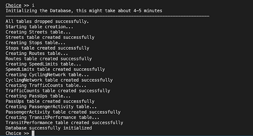
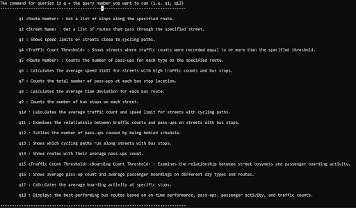
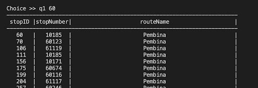

# Introduction
Our database project will use a Java command-line interface (CLI) to implement its interface. The App.java class will serve as the interface's primary entry point. This class will operate as the controller for the interface, coordinating user and database interactions. Another class called Database.java will manage database connectivity and query execution, facilitating interaction with the database.

When App.java is executed, the user will see a menu of options, each of which represents a different operation or query in the database. The command line interface will be used by the user to enter their selection. The chosen query will then be executed by App.java by connecting to the SQLite3 database using the methods supplied by Database.java. The query's outcomes will be obtained and shown to the user in the console.

The command-line interface will include an easy-to-use menu structure that is visually appealing, with each query option labeled for the user deciding on. Guidance through the user's interaction process will be provided by error handling and helpful messaging. The interface will put an emphasis on efficiency and simplicity, giving users a simple way to interact with the database and access the information they need.

# Overview of Interface

### Menu
'Welcome to Winnipeg Road Transport Database!' appears at the top, followed by directions to begin by typing 'm' for the menu. Then, it provides a list of commands such as 
```
Choice >> m
        i - Initialize the database

        d - Delete the Database

        m - Display the Menu.

        q? - Display the queries instruction.

        e - Exit the system.
```
Which would then provide you with clear instruction on how to proceed further.

### Initialize
For first-time users, the interface requires initialization of the database by inputting ‘i’ into the command line. This action triggers the creation of all necessary tables and safely populates them with data from .csv files. Robust error handling ensures that, if any issues arise during the initialization process, the database is completely dropped (erased) to maintain atomicity and data integrity. This would guarantee that no partial or corrupted data remains in the system. Returning users can skip this step if the database has been initialized already.



### Queries
Once it has been initialized, users can prompt ‘q?’ to view the list of queries which will provide them all the available queries along with a meaningful description.



Among the available queries, some queries might require further input from the users in order to execute it.  
Example 1: q1 requires a Route Number (not necessarily INT)  to get list of stops on that route so the user would need to enter: q1 60 or q1 Blue \
This would then get the query to execute and display the output.




# Things required before running the project
Since database used is SQLite, you will need that to be installed in your machine. You can use a terminal-based package manager to download or can download from this [link](https://www.sqlite.org/download.html).

There is one external library used to connect to the database and fetch the queries, which is `mssql-jdbc-11.2.0.jreX`, where X is the java version in your machine. In `lib` directory the library compatible with _java 11_, _java 17_ and _java 18_ is already provided. For any other version here is a [guide](mssql-jdbc-11.2.0.jre11).

By default the Makefile will compile and run the code in __java 18__.

# Running the Interface

```
make buildrun
```

Since this is a terminal base interface, you can run this in any terminal. Run the following command in the root directory of the repository to start the application and explore the queries available

```
make run
```
You would need authorization to connect to the database (on uranium.cs.umanitoba.ca server). If you do, begin by updating the 'auth.cfg' file with your credentials. \
For example,
```
username=<UMNetID>
password=<Student or staff number>
```
**Your're all set to explore the Database !!!**

$\\$
$\\$

### Group Members
[Shiv Gandhi](https://github.com/Shivv10) \
[Andrei Sholokhov]() \
[Quy Nguyen]() \
